# Part 3 — 情境二：Design from Code

> **授課對象**：不懂程式邏輯的設計師
> **時長**：15 分鐘
> **目標**：用 Claude Code 把 AI 生成的雜亂 prototype 整理成具設計規範的系統
> **圖片位置**：`Slide/Image/Part3/`

---

## Slide 01 — Section Divider · 情境二：Design from Code

> **kicker**：（無）
> **Title**：情境二：Design from Code  如何從 Code 重構 UI 系統
> **Sub**：透過 Claude Code，將 AI 生成的雜亂介面重構為具一致性的設計系統

---

## Slide 02 — 專案現況與接手目標

> **Kicker**：情境二：Design from Code
> **Title**：專案現況與接手目標
> **Sub**：（無）

### 接手現況
- **只有 Code、沒有設計稿**
- **視覺缺乏一致性**
- **元件未標準化，重複且難以維護**


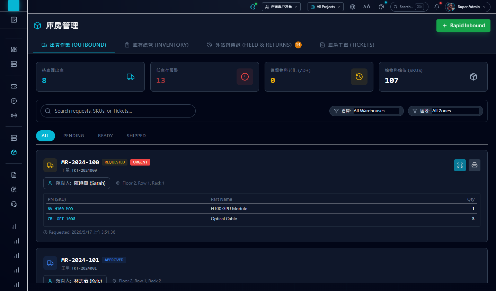

### 設計師接手目標
- 把畫面「整理成具設計規範的系統」

### 三步框架

| 步驟 | 動作 | 副標 |
|---|---|---|
| ① | **建立專案認知** | 給 Claude 一份專案 Brief |
| ② | **重構設計規範** | 告訴它「對的樣子」 |
| ③ | **建立設計 SOP** | 把常用指令模組化 |

---

## Slide 03 — Step 1｜建立專案認知：給 Claude 一份 Brief

> **Kicker**：情境二：Design from Code
> **Title**：Step 1｜建立專案認知：給 Claude 一份 Brief
> **Sub**：「在這個專案裡，我們是這樣做事的」

### CLAUDE.md 是什麼

- **角色**：專案專屬的「開發守則」 — 啟動時 Claude 會自動讀過
- **內容**：通用規則，例如計畫前要先讀取檔案、執行前要先詢問、有疑問要停下執行

### 一個指令搞定

在 Claude Code 輸入 **`/init`**，它會自動讀過整個專案，產出一份 `CLAUDE.md`。

### CLAUDE.md 範例（macOS preview window）

`CLAUDE.md`

```markdown
# admin-portal

## 技術棧
- React 18 + TypeScript
- Tailwind v4
- shadcn/ui

## 通用規則
- 計畫前先讀檔
- 執行前要詢問
- 有疑問停下執行
```

---

## Slide 04 — Step 2-1｜盤點現有共用元件

> **Kicker**：情境二：Design from Code
> **Title**：Step 2｜重構設計規範：盤點與收斂共用元件
> **Sub**：找出現有共用元件、統一樣式

| 子步驟 | 重點 |
|---|---|
| **2-1 盤點現有共用元件**（Claude 掃描） | Prompt：「找出專案中共用的 UI 元件，告訴我路徑」。⚠️ 元件「存在」**不代表**功能頁有引用 |
| **2-2 重新定義元件樣式** | 把「對的樣子」說清楚 — 用 Prompt / 截圖 / Figma MCP。下節展開 |
| **2-3 功能頁引用檢查** | Prompt：「檢查頁面元件是否使用既有共用元件」 |

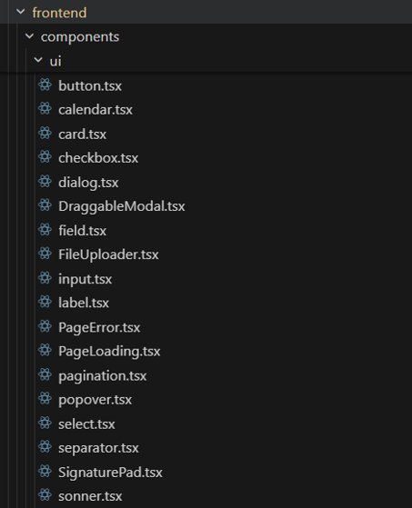

---

## Slide 05 — Step 2-2｜三種調整方式

> **Kicker**：情境二：Design from Code
> **Title**：Step 2｜重構設計規範：三種調整方式
> **Sub**：依問題類型選擇不同方式：Prompt、截圖、Figma MCP

> **幫 Claude 建立「對的樣子」的座標**

| 工具 | 適合 | 說明 |
|---|---|---|
| **Prompt** | 結構明確、規則清楚 | 元件樣式、間距、尺寸…可描述的規則 |
| **截圖** | 看感覺、視覺對齊 | 局部 UI 或參考頁 |
| **Figma MCP** | 一致性、大範圍 | 透過元件結構或樣式來源同步 |

---

## Slide 06 — Step 2｜如何看到實際畫面

> **Kicker**：情境二：Design from Code
> **Title**：Step 2｜重構設計規範：如何看到實際畫面
> **Sub**：（無）

### 三步流程

**① 打開瀏覽器**
跟 Claude 說「打開瀏覽器看畫面」

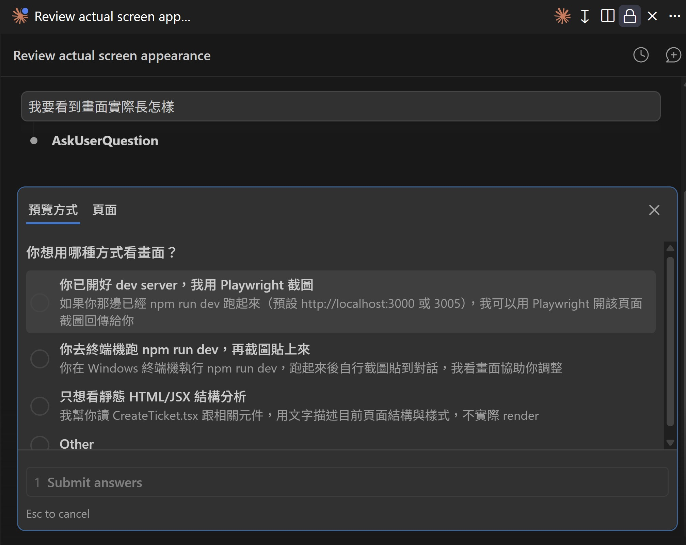

**② 同意執行**
Claude 要做事前會跳「要不要繼續」的詢問 — 看不懂他在問什麼沒關係，只要你想要他繼續，就按 `yes`

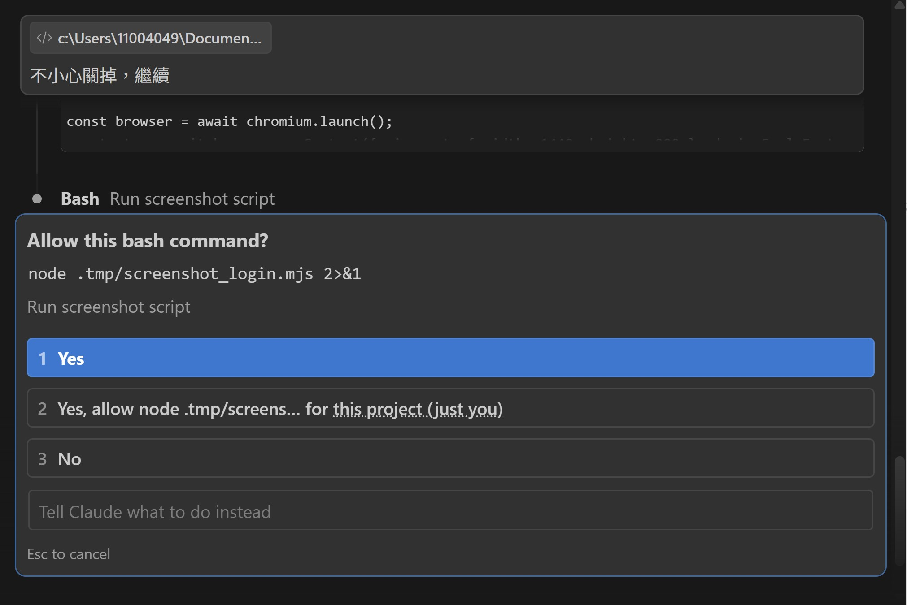

**③ 打開連結**
Claude 會印一個 URL，**點下去或複製到瀏覽器**都可以看到結果

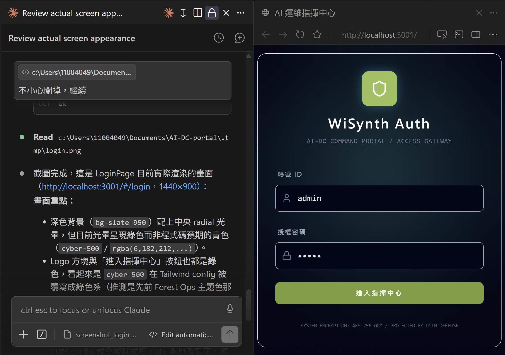

### 補充：Claude 只「告訴你怎麼做」時

有時候 Claude 會把步驟印給你看（「請在另一個視窗執行 ...」），但不動手做。

→ **用老闆思維叫他做**：
> 「直接幫我做」
> 「幫我解決」

<!-- 備註：Image/Part3/情境二_看畫面過程02.jpg 未被引用，若不用可考慮刪除 -->

---

## Slide 07 — 範例 01｜Prompt 快速修正設計樣式

> **Kicker**：情境二：Design from Code．Step 2｜重構設計規範
> **Title**：範例 01｜Prompt 快速修正設計樣式
> **Sub**：（無）

**適用於：版面穩定、資料單純的頁面**
快速做設計一致性

實際Prompt會像這樣：
- 移除不在設計規範內的顏色
- 套用元件的 hover / active 狀態樣式
- 統一按鈕與文字顏色

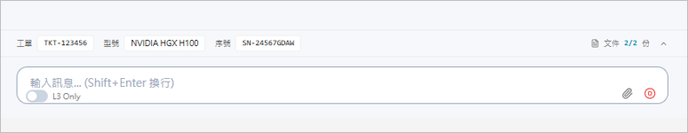


---

## Slide 08 — 範例 02｜用截圖 + Prompt 對齊設計細節

> **Kicker**：情境二：Design from Code．Step 2｜重構設計規範
> **Title**：範例 02｜用截圖 + Prompt 對齊設計細節
> **Sub**：（無）

**提供視覺參考時，Claude 執行上更貼近設計需求。**


---

## Slide 09 — 範例 03｜Figma MCP 開場 + 確認連線

> **Kicker**：情境二：Design from Code．Step 2｜重構設計規範
> **Title**：範例 03｜Figma MCP
> **Sub**：（無）
 
**專案只有 Code 沒有圖稿 — 透過 MCP 反向把 Code 畫面傳到 Figma 做設計調整**

**確認　Figma MCP 連線**
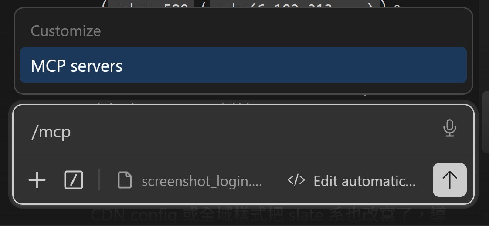
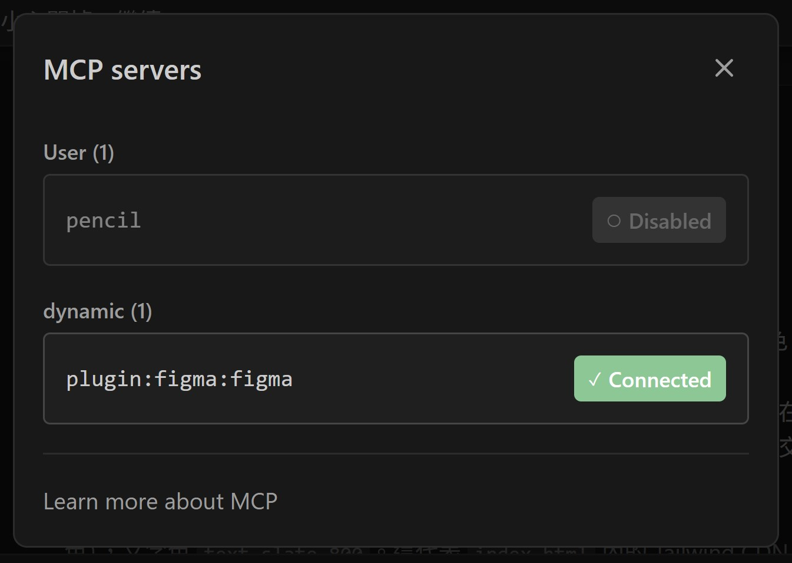

---

## Slide 10 — Figma MCP｜② 把畫面傳到 Figma

> **Kicker**：情境二：Design from Code．Step 2｜重構設計規範
> **Title**：範例 03｜Figma MCP
> **Sub**：（無）

**把畫面傳到 Figma**
**① 下 prompt**（待補完整 prompt 文字 — 從截圖讀出後潤飾）

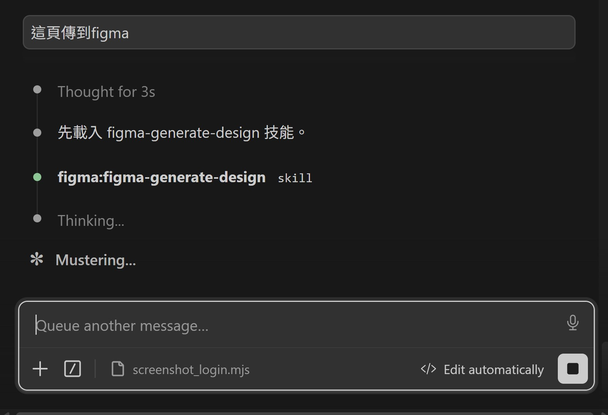

**② 選擇 Figma 目標檔案**

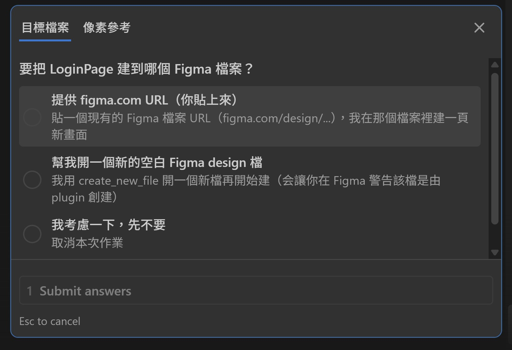
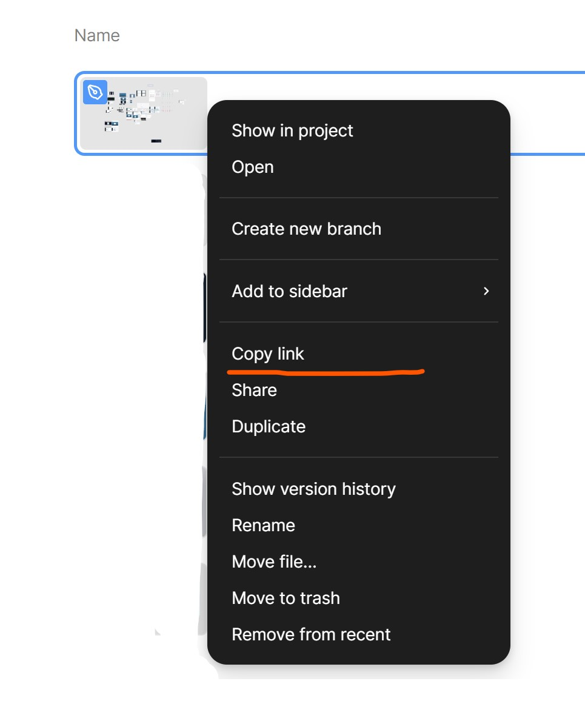

**③ 選取傳送範圍**


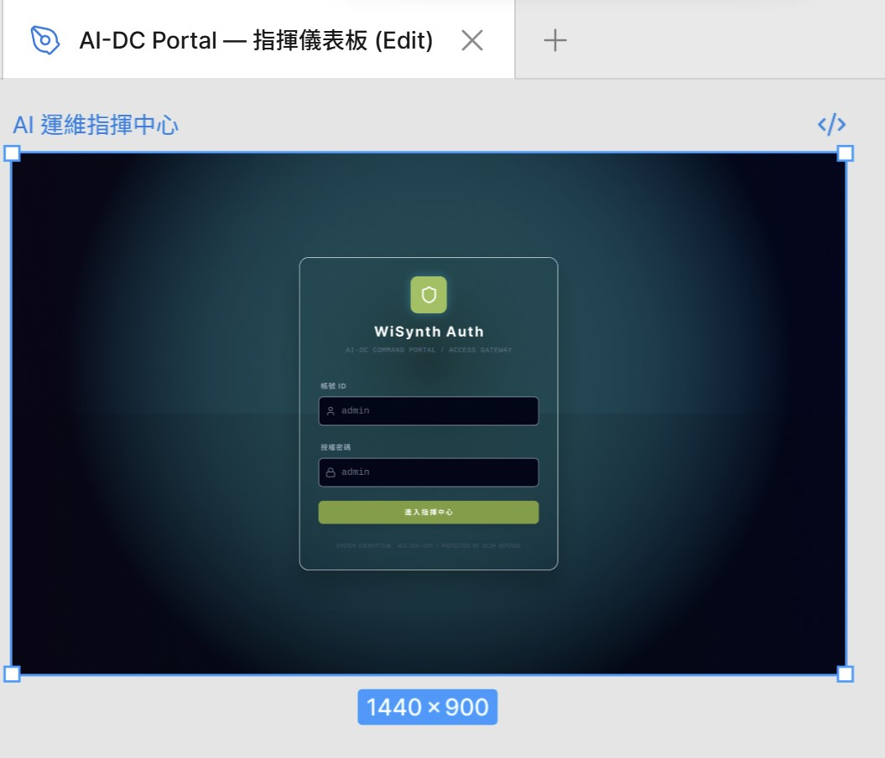

---

## Slide 11 — Figma MCP｜③ Claude 依 Figma 反向改 Code

> **Kicker**：情境二：Design from Code．Step 2｜重構設計規範
> **Title**：範例 03｜Figma MCP
> **Sub**：（無）
**Claude 依 Figma 反向改 Code**
**指示 Claude**：
> 「畫面對齊這頁，列出你會調整的內容」

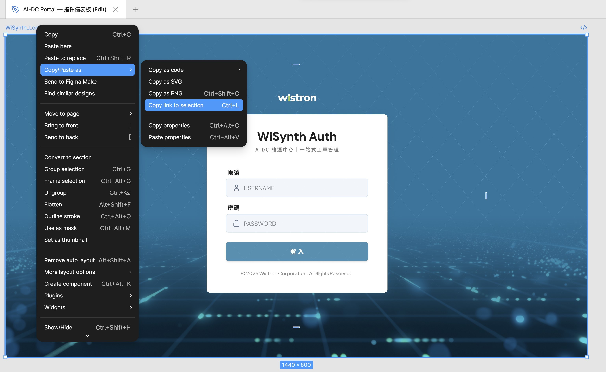

**成果**：


---

## Slide 12 — Step 3｜建立設計 SOP：Skill.md

> **Kicker**：情境二：Design from Code
> **Title**：Step 3｜建立設計 SOP：Skill.md
> **Sub**：將重複出現的設計判斷與檢查流程，變成可反覆使用的規則

### Skill 是什麼

> **Skill = 標準作業程序（SOP），把你重複在做的判斷或檢查，存成 AI 也懂的固定流程。**

### 檔案路徑結構

```
.claude/
└── skills/
    └── visual-check/
        └── SKILL.md
```

### SKILL.md 範本（macOS preview window）

```markdown
---
name: visual-check
description: 掃描頁面，找出不符設計樣式的項目並產出 .md 計畫
---

## 任務
掃描指定檔案，列出 color / spacing / radius / 字級 / icon 尺寸 的不一致

## 不會碰
元件結構、互動邏輯、資料流（留給 RD）

## 產出
一份結構化 .md 清單
```

---

## Slide 13 — Step 3｜Skill.md：使用方式與放置

> **Kicker**：情境二：Design from Code
> **Title**：Step 3｜建立設計 SOP：Skill.md
> **Sub**：使用方式與儲存位置

### Skill 使用方式

| 方式 | 怎麼觸發 |
|---|---|
| **主動呼叫** | `/skill visual-check` （明確要求執行特定檢查）|
| **被動觸發** | Prompt：「請檢查此頁面的視覺一致性」 → Claude 會依 description 自動比對並套用 Skill |

### Skill 怎麽建、怎麽放？
從實際修改過程中反推規則，並找 Claude 討論建置內容 — Prompt：「把這幾次改動的過程梳理成 SOP 建議，建立 Skill」
不用自己手動建資料夾或檔案 — **直接請 Claude 建、放**就好。


> **把個人設計審核的工作流程，變成可以被複製的系統能力。**

---

## Slide 14 — Prompt vs CLAUDE.md vs Skill 對照

> **Kicker**：情境二：Design from Code
> **Title**：Prompt vs CLAUDE.md vs Skill.md
> **Sub**：（無）

|  | Prompt | CLAUDE.md | Skill.md |
|---|---|---|---|
| **角色** | 這一次的指令 | 專案的工作守則 | 特定任務的 SOP |
| **時機** | 你每次輸入 | 啟動時自動載入 | 你呼叫它才執行 |
| **比喻** | 隨口交辦 | 員工手冊 | 個別工序的作業流程 |

---

## Slide 15 — 防呆｜存檔與回復

> **Kicker**：情境二：Design from Code
> **Title**：存檔與回復
> **Sub**：（無）

用 Claude 改畫面 = 反覆嘗試 — 只要有版本紀錄，就可以放心改、隨時回頭。

### 先建立一個觀念

安裝 Claude 的過程會一起裝 Git — 它就是「**版本記錄器**」。
作用就像 Figma 的版本歷史。

- 一般存檔 = 覆蓋目前檔案
- Git 的存檔叫做「Commit」 = 存下「帶有紀錄的版本」，會記得：改了什麼

### ① 怎麼存檔（Commit）

每完成一段修改，就存一個版本。

**Prompt**：
> 「請幫我存檔」
> 「Commit」

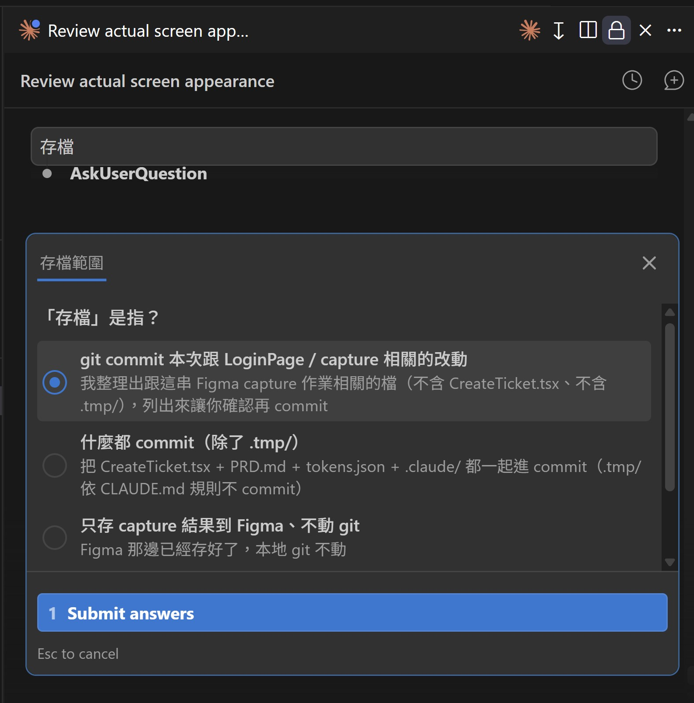

### ② 怎麼回復

如果改錯，直接回到指定版本。

**Prompt（三選一）**：
> 「請幫我回到上一個版本」
> 「請幫我回到剛剛加完 hover 效果那個版本」
> 「請幫我回到 abc1234 那個版本」（有版號時）

**存檔資料在哪裡**：

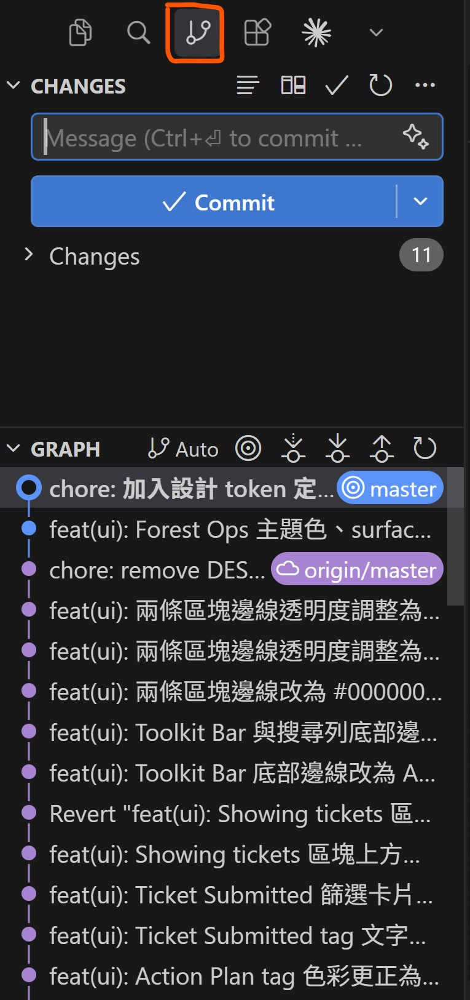

**版本編號怎麼看**：

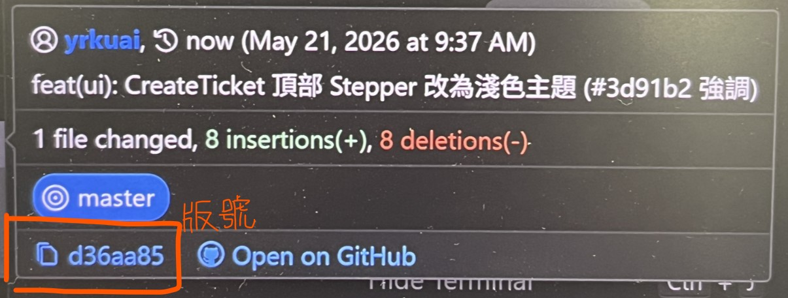
